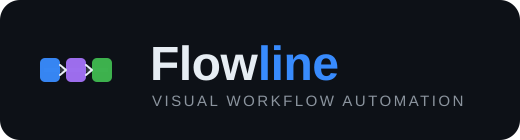

<p align="center">
  
</p>

<p align="center">
  <a href="LICENSE"></a>
  <a href="https://nodejs.org"></a>
  <a href="docker-compose.yml"></a>
</p>

A visual, node-based automation platform for building, running, and monitoring
multi-step workflows. Wire together reusable **nodes** on a drag-and-drop canvas —
call APIs, transform data, branch and loop, run scripts, and send notifications — then
schedule them, trigger them from webhooks/email/files, and inspect every run.

- **Frontend** — React 19 + Vite, ReactFlow canvas, Zustand, Monaco editor
- **Backend** — Node.js 22 + Fastify 5, SQLite (better-sqlite3), a worker-thread run
  engine with 34 built-in node types
- **Sidecars** — WhatsApp bridge, Whisper voice-to-text, optional Ollama / cloud LLMs

See **[DOCS.md](DOCS.md)** for the full user guide and node reference.

## Quick start (Docker)

```bash
git clone <your-repo-url> flowline && cd flowline
cp .env.example .env    # then edit secrets/URLs as needed
docker compose up --build
```

Then open **http://localhost:3001**. Services:

| Service | Port | Purpose |
|---|---|---|
| `app` | 3001 | Backend API + built frontend |
| `whatsapp-bridge` | 3002 | WhatsApp send/receive bridge |
| `voice-to-text` | 9000 | Whisper transcription sidecar |

Data (SQLite DB, files, license/instance state) persists in the `workflow_data`
volume mounted at `/app/data`.

> **Secure your instance.** Set `API_TOKEN` in `docker-compose.yml` — without it,
> anyone who can reach port 3001 can read workflows, run them, and export decrypted
> secrets. See the "Admin & Backup" section of [DOCS.md](DOCS.md).

## Local development

```bash
# backend  (http://localhost:3001)
cd backend && npm install && npm run dev

# frontend (Vite dev server)
cd frontend && npm install && npm run dev
```

Copy `.env.example` to `.env` first — both `npm run dev` and Docker Compose read
it for `WEBHOOK_SECRET`, optional `API_TOKEN`, sidecar URLs, and the premium
license key.

## Building

Each package builds independently. Node 22 is required (the backend compiles the
native `better-sqlite3` addon).

```bash
# backend → TypeScript compiled to backend/dist
cd backend && npm install && npm run build

# frontend → static bundle in frontend/dist
cd frontend && npm install && npm run build
```

Run the backend test suite (and lint the frontend) before shipping:

```bash
cd backend && npm test
cd frontend && npm run lint
```

The production Docker image performs both builds in separate stages and copies
the frontend bundle into the backend's `public/` directory, so a single `app`
container serves the API and the UI together.

## Deployment

The supported deployment path is Docker Compose. It builds three services from
this repo — `app` (API + frontend), `whatsapp-bridge`, and `voice-to-text` — and
provisions the persistent volumes.

```bash
git clone <your-repo-url> flowline && cd flowline
cp .env.example .env       # set WEBHOOK_SECRET and API_TOKEN at minimum
docker compose up --build -d
```

Then open **http://localhost:3001**.

**Before exposing an instance publicly:**

- **Set `API_TOKEN`.** Uncomment it in `.env` / `docker-compose.yml`. Without it,
  anyone who can reach port 3001 can read workflows, run them, and export
  decrypted secrets.
- **Set `WEBHOOK_SECRET`** and use the same value in every webhook trigger in the
  UI and in the WhatsApp bridge.
- **Set `CORS_ORIGIN`** if the UI is served from a different origin (otherwise
  requests are same-origin only).
- **Put a TLS-terminating reverse proxy** (nginx, Caddy, Traefik) in front of
  port 3001; the app speaks plain HTTP.

**Persistent state** lives in named volumes — the SQLite DB, files, and
license/instance state in `workflow_data` (mounted at `/app/data`), WhatsApp auth
in `wa_auth`, and Whisper models in `vtt_models`. Back up `workflow_data`
regularly; see the "Admin & Backup" section of [DOCS.md](DOCS.md).

**GPU note:** the `voice-to-text` service requests an NVIDIA GPU (needs the NVIDIA
Container Toolkit). To run Whisper on CPU, set `WHISPER_DEVICE=cpu` in `.env` and
remove the `deploy.resources` block from that service in `docker-compose.yml`.

**Updating:** pull the latest changes and rebuild — `git pull && docker compose up
--build -d`. Schema migrations run automatically on startup; the data volume is
preserved across rebuilds.

## Editions & licensing

Flowline is **open-core**:

- The **core** — everything except the premium directories below — is free software
  under the **[GNU AGPL-3.0](LICENSE)**. You may self-host, modify, and use it for any
  purpose, including commercially, subject to AGPL's terms (notably: if you offer a
  modified version as a network service, you must publish your source changes).
- The **premium tier** is a paid add-on under a separate commercial license
  ([LICENSE-PREMIUM](LICENSE-PREMIUM)), unlocked at runtime by a signed license key:

  | Premium feature | Directory |
  |---|---|
  | LLM Assistant | `backend/src/plugins/assistant/` |
  | Housekeeping | `backend/src/plugins/housekeeping/` |
  | Artifact History | `backend/src/plugins/artifact-history/` |

  Premium source ships in this repo for transparency, but using or enabling it requires
  a commercial license and key. How the key gate works (Ed25519-signed, instance-bound,
  expiring) is documented in **[PREMIUM-LICENSING.md](PREMIUM-LICENSING.md)**.

Running without a license key gives you the full free edition — no premium surfaces,
everything else works.

## Documentation

- [DOCS.md](DOCS.md) — user guide, node reference, keyboard shortcuts
- [PREMIUM-LICENSING.md](PREMIUM-LICENSING.md) — premium licensing & key enforcement
- [CONTRIBUTING.md](CONTRIBUTING.md) — how to contribute (note the CLA)
